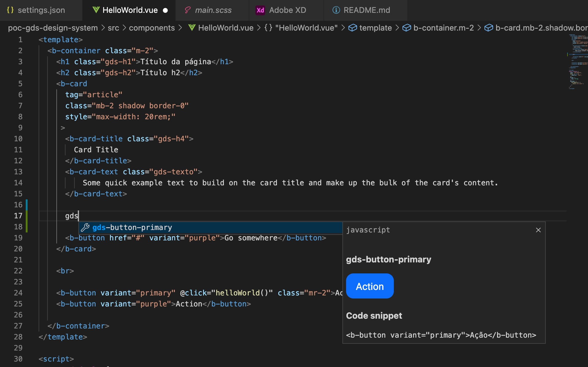

# getrak-dsp beta
Getrak Design System Package beta é a especificação da criação de novos produtos Getrak, contendo uma documentação viva em constante evolução, para que designers, desenvolvedores e PM/POs estejam sempre alinhados na criação de produtos com maior escala, consistência e agilidade.

## Como enxergar o getrak-dsp no meu ambiente?
Faça o download do projeto na sua máquina, deixe o pacote ao lado da pasta do seu projeto.
Agora que você tem o `getrak-dsp`, você deve instalar o [Adobe XD extenstion](https://marketplace.visualstudio.com/items?itemName=Adobe.xd&ssr=false#overview) no seu ambiente VS Code para abrir qualquer pacote dsp. Depois de instalar a extensão, abra o painel do Adobe XD e selecione a opção `Load package`. Então navegue à pasta que se encontra o `getrak-dsp` (DSPs contem um arquivo dsp.json no nível raiz) e selecione-a. Pule as etapas de cópia de arquivos e pronto! Você já pode visualizar Getrak Design System :D

Se possível, assista uma pequena [lista de vídeos](https://letsxd.com/vscode) explicando como consumir um DSP package.

## O que está no pacote?
Os design tokens estão disponíveis na pasta `/dist/styledictonary` para CSS, SCSS e JavaScript.
Os code snippets estão disponíveis para JavaScript Vue, HTML e Javascript React. No caso do Vue, estamos utilizando como base o [BootstrapVue](https://bootstrap-vue.org/), e customizando o tema do Bootstrap via arquivo SCSS, portanto se faz necessário instalar [este pacote](https://www.npmjs.com/package/bootstrap-vue).

## Como posso usar o getrak-dsp?
O `getrak-dsp` não cria os componentes para você, ele é uma documentação viva acessível por atalhos, portanto, seu projeto deve conter os componentes que os `code snippets` estejam chamando, assim como suas dependências. Como no caso citado (BootstrapVue), onde você terá um arquivo `.scss` importando o Bootstrap e customizando algumas de suas variáveis através dos design tokens. Os design tokens estão acessíveis para que você faça o melhor uso nos seus componentes customizados ou para customizar algum framework, como no exemplo.

Veja como o `getrak-dsp` está sendo utilizado em um [projeto Vue](https://github.com/denysrocha/poc-gds-design-system), tendo como base o [BootstrapVue](https://bootstrap-vue.org/)

## Feedback
Para perguntas, problemas ou feedback, por favor abra uma [issue aqui](https://github.com/denysrocha/getrak-dsp/issues)
